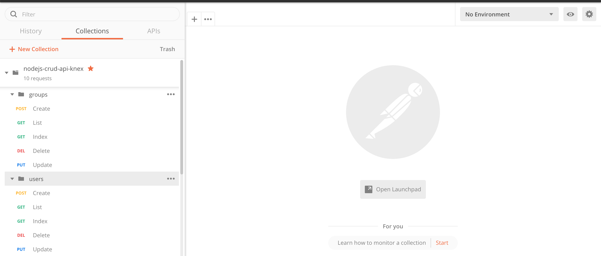

# NodeJS - CRUD API with EXPRESS + KNEX

This is a simple project, built on nodejs, to provide a sample of the CRUD API with express + knexjs.


1. System Requirements

- NodeJS + NPM 

2. Clone repository

> git clone git@github.com:silvioramalho/nodejs-crud-api-knex.git

3. Install packages

```
cd nodejs-crud-api-knex
npm install
```

4. Project Structure

```
/
/src/
/src/controllers/
/src/routes/
/src/database/
/postman/
```

5. Create database SQLite:

> npx knex migrate:latest


6. Run Application

> npm start

7. Manual Application Testing

Import the Postman Collection finded in /postman/

